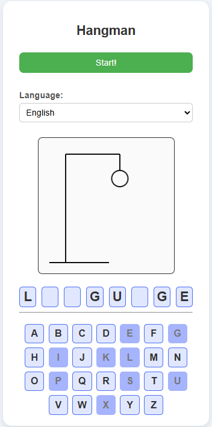

# 🧍 Hangman_JS
A simple Hangman game made with HTML, CSS, and vanilla JavaScript.

## 🗒️ Features
- Multiple languages : French and English (only a few words for both)
- Later : Add your own word

## 📷 Screenshot

## How to Run

▶️ **Play directly on CodePen:**  
[https://codepen.io/Witchoy/pen/gbpvKZm](https://codepen.io/Witchoy/pen/gbpvKZm)

**OR**

1. Clone the repository:  
   `git clone https://github.com/Witchoy/Hangman_JS.git`

2. Open `game/index.html` in your favorite web browser.

3. Enjoy the game!

## Author
[Jules Goy](https://github.com/Witchoy)
