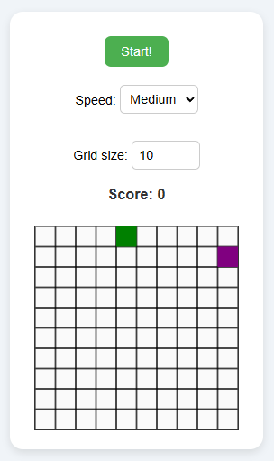

# 🎮 Simple Little Games with HTML, CSS & Vanilla JavaScript

This repository showcases small games I made using only HTML, CSS, and vanilla JavaScript.

---

## 🧍 Hangman_JS

A simple Hangman game made with HTML, CSS, and vanilla JavaScript.

### 🗒️ Features

* Multilingual support: **French** and **English** (limited word set for now)
* Planned feature: Add your own custom words

### 📷 Screenshot

### ▶️ How to Run

* **Play directly on CodePen:**
  [https://codepen.io/Witchoy/pen/gbpvKZm](https://codepen.io/Witchoy/pen/gbpvKZm)

**OR**

1. Clone the repository:
   `git clone https://github.com/Witchoy/Hangman_JS.git`

2. Open `game/index.html` in your favorite web browser.

3. Enjoy the game!

---

## 🐍 Snake\_JS

A simple Snake game made with HTML, CSS, and vanilla JavaScript.

### 🗒️ Features

* Customizable grid size
* Keyboard controls (Arrow keys and ZQSD)
* Adjustable game speed
* Score tracking

### 📷 Screenshot

### ▶️ How to Run

* **Play directly on CodePen:**
  [https://codepen.io/Witchoy/pen/KwpPxgp](https://codepen.io/Witchoy/pen/KwpPxgp)

**OR**

1. Clone the repository:
   `git clone https://github.com/Witchoy/Snake_JS.git`

2. Open `game/index.html` in your favorite web browser.

3. Enjoy the game!

---
### 👤 Author

[Jules Goy](https://github.com/Witchoy)
